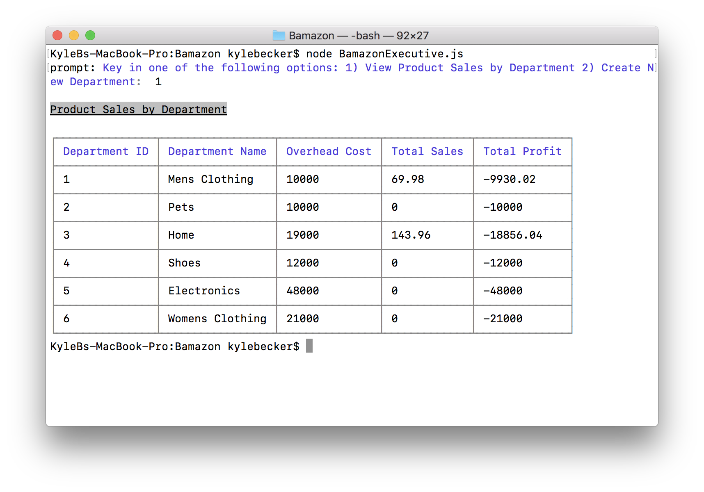

#Bamazon

### Synopsis
***

An interactive shopping node app where MySQL and Node.JS are used to allow users to purchase items as a customer, view, track and update the product inventory as a manager, and track the total sales by department as an executive.

##### Bamazon Customer Portal
***

The Bamazon Customer can view the items available to purchase. The user will be prompted to enter the item id# and how many items they wish to purchase. If the item is in stock, the order will be completed and the user will see the total amount of their purchase.

##### Bamazon Manager Portal
***

The Bamazon Customer Portal allows users to view and edit the inventory of the store. The user will be prompted to choose from the following options:
* View products for sale
* View low inventory
* Add to inventory
* Add a new product

###### Manager Options
***
The manager functions can be run using the BamazonManager.js script.

The first option allows the user to see a list of products that are currently for sale, it's department, price, and how much stock is left for that product.

The second option provides a list of products with less than 5 items in stock. If no item has less than 5 items in stock, the table will simply be empty. 

The third option updates the inventory of a product using the unique id for the product. 

The last option adds a new product. A product id#, name, existing department, price, and quantity are required.

##### Bamazon Executive
***
The executive funtions can be run using the BamazonExecutive.js script. 

The Bamazon Executive section allows the user to view total profit by department, in addition to having the ability to add additional departments.  

#### Technologies Used:
***

* Javascript
* nodeJS
* MySQL
* npm packages:
	- [mysql](https://github.com/felixge/node-mysql)
	- [prompt](https://github.com/flatiron/prompt)
	- [colors/safe](https://github.com/Marak/colors.js)
	- [cli-table](https://github.com/Automattic/cli-table)

